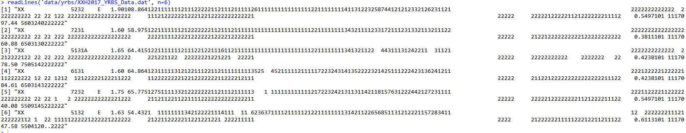
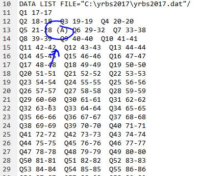
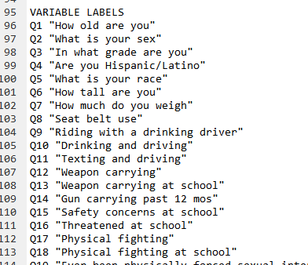
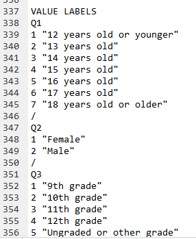

```{r setup, include=FALSE}
knitr::opts_chunk$set(echo = TRUE)
library(magrittr)
```

## setup

```{r, eval=F}
install.packages(c("dplyr",
                   "magrittr",
                   "purrr",
                   "readr",
                   "stringr",
                   "tibble",
                   "tidyr",
                   ))
```

```{r, eval=F}
dir.create('../data')
dir.create('../data/yrbs')
```

## Get Data

```{r, eval=F}
national_grab <- "https://www.cdc.gov/healthyyouth/data/yrbs/files/2017/XXH2017_YRBS_Data.dat"
national_loc <- "../data/yrbs/XXH2017_YRBS_Data.dat"

download.file(national_grab, national_loc)

sas_input_grab <- 'https://www.cdc.gov/healthyyouth/data/yrbs/files/2017/2017XXH_SAS_Input_Program.sas'
sas_input_loc <- "../data/yrbs/2017XXH_SAS_Input_Program.sas"

download.file(sas_input_grab, sas_input_loc)

sas_format_grab <- "https://www.cdc.gov/healthyyouth/data/yrbs/files/2017/2017XXH_Formats_Program.sas"
sas_format_loc <- "../data/yrbs/2017XXH_Formats_Program.sas"

download.file(sas_format_grab, sas_format_loc)

spss_syntax_grab <- 'https://www.cdc.gov/healthyyouth/data/yrbs/files/2017/2017XXH_SPSS.SPS'
spss_syntax_loc <- "../data/yrbs/2017XXH_SPSS.SPS"

download.file(spss_syntax_grab, spss_syntax_loc)
```

## Obtain Variable/Parsing Information

The original SPSS and SAS files we got from the CDC is not actually data, but format/input/syntax files meant o create the data. Unfortunately, I couldn't find a readily available package that could make use of this build code, so I manually got the relevent information and build the data using R. 

We are going to make use of the *2017XXH_SPSS.SPS* file. This file gives us SPSS instructions to convert the .dat file into actual data. The dat file is imply a text file



The .sps file contains the rule needed to interpret the dat file. We can get the name of variables be cause the .sps file provides the location of each variable on every line



It also provides a helpful description for each variable. 



And the factor levels of relevent variables. 



## Extract Var Names 

```{r}
var_loc <- readLines('../data/yrbs/2017_VAR_LOCS') %>%
  stringr::str_trim() %>%
  stringr::str_split('\\s+') %>%
  do.call(c, .) %>%
  matrix(ncol = 2, byrow = 2) %>%
  {colnames(.) <- c('var', 'loc'); .} %>%
  tibble::as_tibble() %>%
  tidyr::separate(loc, c('begin', 'end')) %>%
  dplyr::mutate_at(c('begin', 'end'), as.numeric) 

var_info <- readLines('../data/yrbs/2017_VAR_INFO') %>%
  stringr::str_split('\\s+', n = 2) %>%
  do.call(rbind, .) %>%
  {colnames(.) <- c('var', 'desc'); .} %>%
  tibble::as_tibble() %>%
  dplyr::mutate(desc = stringr::str_remove_all(desc, '"')) %>%
  dplyr::left_join(var_loc) %>%
  dplyr::mutate(var = stringr::str_to_upper(var))

var_labs <- readLines('../data/yrbs/2017_VAR_LABS') %>%
  paste(collapse = '\n') %>%
  stringr::str_split('\n/\n?') %>%
  .[[1]] %>%
  .[. != '']

var_lab_names <- stringr::str_extract(var_labs, '^[^\n]+\n')

var_lab_values <- stringr::str_remove(var_labs, var_lab_names) %>%
  stringr::str_split('\n')

var_factors <- purrr::map(setNames(var_lab_values, stringr::str_trim(var_lab_names)), function(x){
  data.frame(info =x) %>%
    tidyr::separate(info, c('level', 'lab'), sep = '\\s+', extra = 'merge') %>%
    dplyr::mutate(level = as.numeric(level),
                  lab = stringr::str_remove_all(lab, '"'))
})

```

## Create Data

```{r}
yrbs <- readLines('../data/yrbs/XXH2017_YRBS_Data.dat')

yrbs <- var_loc %>%
  purrr::pmap(function(var, begin, end){
    stringr::str_sub(yrbs, begin, end)
  }) %>%
  do.call(cbind, .) %>%
  {colnames(.) <- stringr::str_to_upper(var_loc$var); .} %>%
  tibble::as_tibble() 

readr::write_rds(yrbs, "../data/yrbs/2017_yrbs_raw.rds")
readr::write_csv(yrbs, "../data/yrbs/2017_yrbs_raw.csv")

for(nm in names(var_factors)){
  yrbs[nm] <- factor(yrbs[[nm]], levels = var_factors[[nm]]$level, labels = var_factors[[nm]]$lab)
}

yrbs <- dplyr::mutate_if(yrbs, function(x){all(!stringr::str_detect(x, "[:alpha:]") & !is.factor(x))}, as.numeric)
```

```{r, eval=F}
readr::write_rds(yrbs, '../data/yrbs/2017_yrbs.rds')
readr::write_csv(var_info, '../data/yrbs/2017_yrbs_key.csv')

yrbs %>%
  dplyr::mutate_if(is.factor, as.character) %>%
  readr::write_csv('../data/yrbs/2017_yrbs.csv')
```
